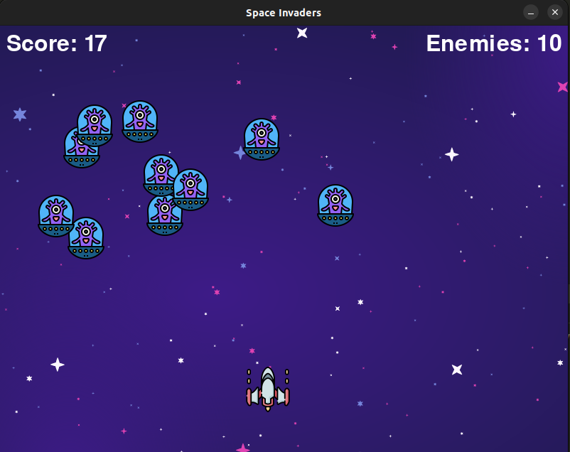

# Python Pygame Projects

## Table of Contents

- [Python Pygame Projects](#python-pygame-projects)
  - [Table of Contents](#table-of-contents)
  - [Introduction](#introduction)
  - [Projects](#projects)
    - [Space Invaders](#space-invaders)

## Introduction

Welcome to the `python_pygame` repository! This repo is a collection of some projects created using the Pygame library. The primary goals of these projects are to enjoy my free time creating simple games while practicing object-oriented programming (OOP), software design, and various programming principles.

## Projects

### [Space Invaders]((https://github.com/Omarkhaled711/python_pygame/tree/master/space_invader))

Space Invaders is a classic arcade game where the player controls a spacecraft to defend against waves of enemies. This project demonstrates the use of Pygame to handle graphics, user input, and game logic.
- 

  
Click to view screenshot

  

