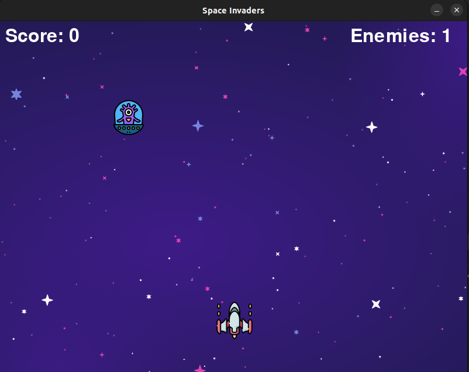
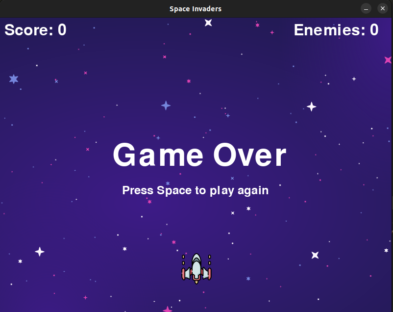

# Space Invaders

## Table of Contents

- [Space Invaders](#space-invaders)
  - [Table of Contents](#table-of-contents)
  - [Introduction](#introduction)
  - [Features](#features)
  - [Installation](#installation)
  - [Usage](#usage)
  - [Screenshots](#screenshots)

## Introduction

Space Invaders is a classic arcade game where the player controls a spacecraft to defend against waves of enemies. This project is a Python implementation of the game using the Pygame library.

## Features

- Player-controlled spacecraft with movement and shooting capabilities
- Enemies that move and drop down the screen
- Collision detection between bullets and enemies, and between the player and enemies
- Score tracking and game over state
- Background music and sound effects

## Installation

1. Clone the repository:

    ```bash
    git clone https://github.com/Omarkhaled711/space-invaders.git
    cd space-invaders
    ```

2. Create and activate a virtual environment (optional but recommended):

    ```bash
    python -m venv venv
    source venv/bin/activate  # On Windows: venv\Scripts\activate
    ```

3. Install the required dependencies:

    ```bash
    pip install -r requirements.txt
    ```

## Usage

1. Run the main game file:

    ```bash
    python3 main.py
    ```

2. Use the arrow keys to move the spacecraft left and right.
3. Press the spacebar to shoot bullets.
4. Avoid colliding with enemies and shoot them down to increase your score.

## Screenshots

Here are some screenshots of the game in action:

- Game Start Screen

    
- In-Game Screen

    
- Game Over Screen

    
